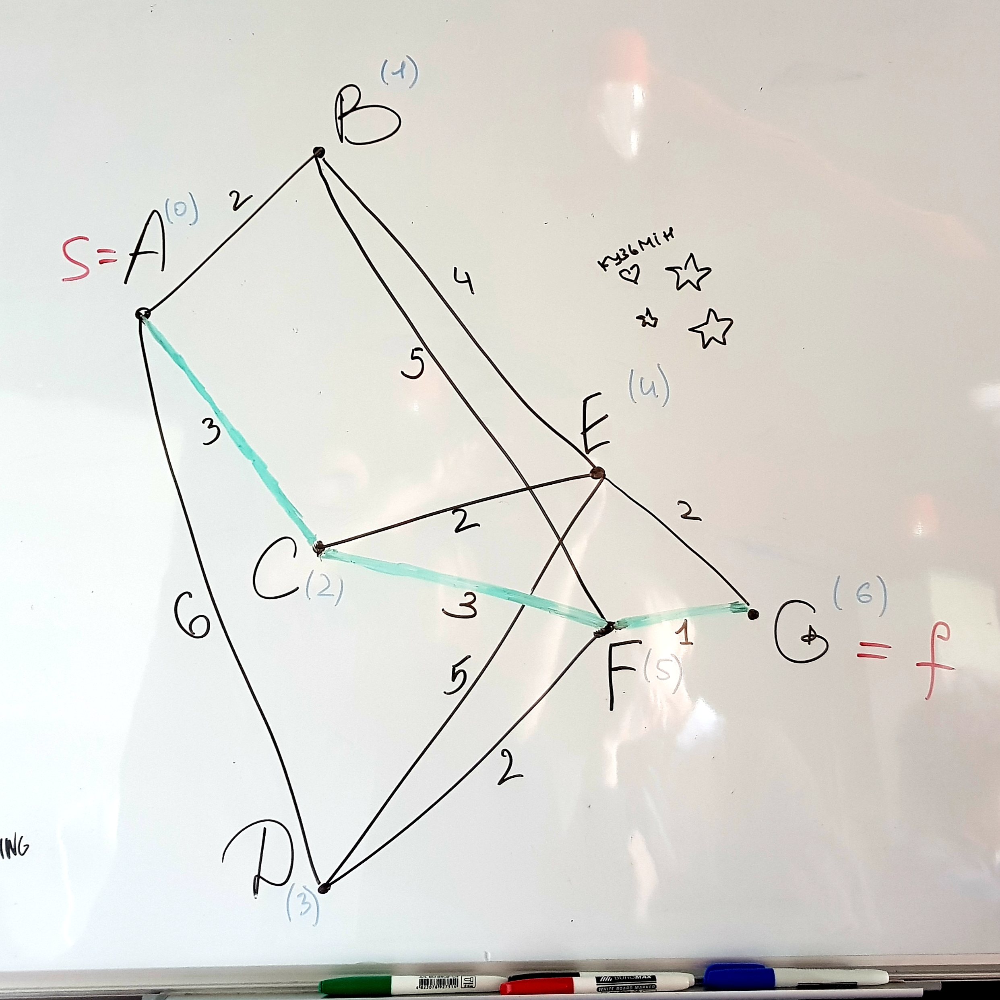
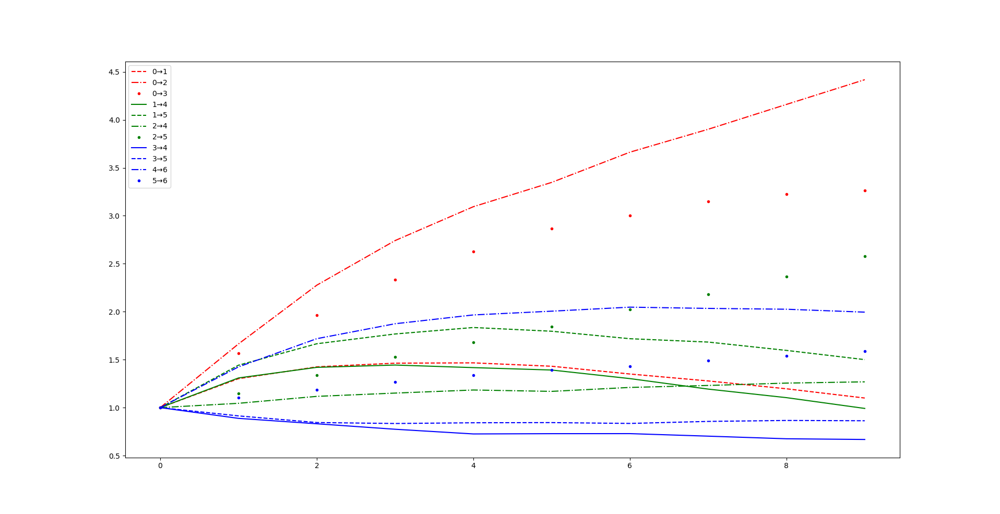
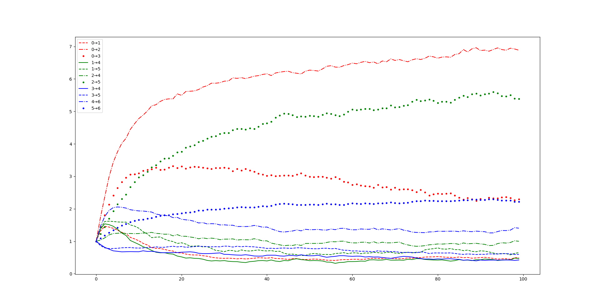
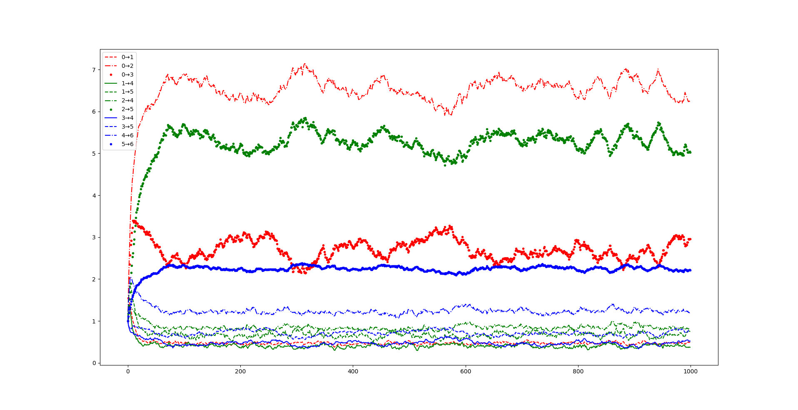



## Мурашиний алгоритм

### Задача комівояджера

#### Постановка задачі

Задано орієнтований граф $$G = (V, E)$$. Ребро $$e_i \in E$$ графа характеризуються довжиною $$\ell_i$$. Задано початкову вершину $$s \in V$$ і цільову (кінцеву, фінальну) вершину $$f \in V$$.

Необхідно знайти найкоротший шлях із $$s$$ до $$f$$.

### Неформальний опис алгоритму

Розглянемо популяцію з $$N$$ мурах, які протягом $$M$$ ітерацій намагаються знайти найкоротший шлях (наприклад, шлях доставки листя до мурашника). 

Уявімо, що на кожній ітерації кожна мурашка проходить якийсь шлях, залишаючи на своєму шляху феромени, і керуючись вже наявними із попередніх ітерацій фероменами для вибору шляху.

<!-- #### Звіт

Доступний до завантаження за [посиланням](traveling-salesman/report.pdf) -->

### Код

#### Представлення графу у пам'яті програми:

```python
g = {
	A: {B: Edge(2), C: Edge(3), D: Edge(6)},
	B: {E: Edge(4), F: Edge(5)},
	C: {E: Edge(2), F: Edge(3)},
	D: {E: Edge(5), F: Edge(2)},
	E: {G: Edge(2)},
	F: {G: Edge(1)},
	G: {},
}
```

де ребро моделюєтсья наступним класом:

```python
class Edge:
	def __init__(self, length):
		self.length, self.feroment, self.delta = length, 1, 0
```

Як бачимо, у ребра є довжина (`length`), на ньому є певна інтенсивність фероменів (`feroment`), і необхідне оновлення фероментів (`delta`).

Ось так цей граф виглядає:



#### Клас, який моделює мурашку:

- конструктор:

```python
class Ant:
	def __init__(self, start, target):
		self.tabu_list = []
		self.vertice = start
		self.target = target
		self.path_length = 0
		self.path = []
		self.alive = True
```

Як ми бачимо з коду, кожна мурашка пам'ятає список вже пройдених вершин (`tabu_list`), знає у якій вершині вона зараз знаходиться (`vertice`), знає, куди їй треба йти (`target`), підтримує у пам'яті загальну довжину пройденого шляху (`path_length`), сам цей шлях (`path`) і знає, чи вона &laquo;жива&raquo; (`alive`). _Мурашка вважається &laquo;мертвою&raquo;, якщо вона не змогла дістатися мурашника._

- метод для вибору напрямку кроку:

```python
def step(self):
	# абсолютні характеристики привабливості дозволених напрямків
	pre_probability = { 
		to : (g[self.vertice][to].feroment + \
			1 / g[self.vertice][to].length)
		for to in (set(g[self.vertice].keys()) - set(self.tabu_list))
	}

	# якщо мурашка не може нікуди йти то вона "мертва"
	if not pre_probability:
		self.alive = False
		return

	# нормалізуємо абсолютні привабливості до відносних
	sum_pre_probability = sum(pre_probability.values())

	probability = {
		to : pre_probability[to] / sum_pre_probability
		for to in pre_probability
	}

	# вибираємо напрямок кроку
	choose_from, choice_probability = [], []

	for t in probability:
		choose_from.append(t)
		choice_probability.append(probability[t])

	step_to = choice(choose_from, p=choice_probability)

	# опрацьовуємо крок
	self.path_length += g[self.vertice][step_to].length
	self.path.append((self.vertice, step_to))
	self.tabu_list.append(self.vertice)
	self.vertice = step_to
```

- метод для пошуку цілісного шляху:

```python
def solve(self):
	while self.vertice != self.target and self.alive:
		self.step()

	if self.alive:
		for f, t in self.path:
			g[f][t].delta += .05 * g[f][t].length / self.path_length**2
```

#### Програма-драйвер:

```python
n, m = 1000, 1000

for i in range(m):
	for j in range(n):
		ant = Ant(start=START, target=END)
		ant.solve()

	for f in g:
		for t in g[f]:
			g[f][t].feroment, g[f][t].delta = \
				.7 * g[f][t].feroment + g[f][t].delta, 0
```

#### Графіки

Інтенсивність фероменів від ітерації:

- 10 ітерацій:

	

- 100 ітерацій:

	

- 1000 ітерацій:

	

#### Швидкодія

Середній час виконання ітерації &mdash; **0.179** секунди, або **3** хвилини на **1000** ітерацій.

Зауважимо, що алгоритм багатоагентний і ідеально паралелиться, тому насправді нас цікавить час виконання однією мурахою однієї ітерації. 

Нескладно зрозуміти, що час виконання однієї мурахо-ітерації мізерний, а саме **0.000179** секунди, тобто одна мурашка може виконати понад **5000** ітерацій за одну секунду.

На більшому графі ($$\vert V \vert = 30$$, $$\vert E \vert = 100$$) швидкодія передбачувано знизиться, але все одно складе принаймні **100** ітерацій на секунду.

Тобто, маючи **16** логічних процесорів (а саме стільки їх у моєму ноутбуці) і розпаралеливши алгоритм можна розв'язати у **50** разів складнішу (і вже цілком реалістичну) задачу десь за **30** хвилин.

Непоганий результат, враховуючи що сама постановка задачі NP-повна.

### Задача про ранець

#### Постановка задачі

Розглянемо відому задачу про ранець: є $$T$$ типів предметів, причому предметів $$i$$-го типу рівно $$q_i$$ штук. 

Предмет $$i$$-го типу характеризується значеннями своєї корисності $$u_i$$ та ваги $$w_i$$. 

Окрім цього є ранець який вміщує довільну кількість предметів сумарною вагою не більше $$W$$. 

Необхідно вибрати підмножину заданих предметів яку можна розмістити у ранці, з максимальною сумарною корисністю.

#### Неформальний опис алгоритму

Розглянемо популяцію з $$N$$ мурах, які протягом $$M$$ ітерацій намагаються спакувати свій &laquo;ранець&raquo; (наприклад, підготувати запаси на зиму, які необхідно розмістити в обмеженому просторі мурашника). 

Уявімо, що на кожній ітерації кожна мурашка пакує свій уявний ранець ходячи туди-сюди до потрібних їй предметів, залишаючи на своєму шляху феромени, і керуючись вже наявними із попередніх ітерацій фероменами для вибору шляху.

#### Звіт 

Доступний до завантаження за [посиланням](knapsack/report.pdf)

#### Код

- Функція generate solution: [python script](knapsack/generate_solution.py)

- Функція calculate feroments: [python script](knapsack/calculate_feroments.py)

- Програма-драйвер: [python script](knapsack/main.py)

[Назад на головну](../README.md)
