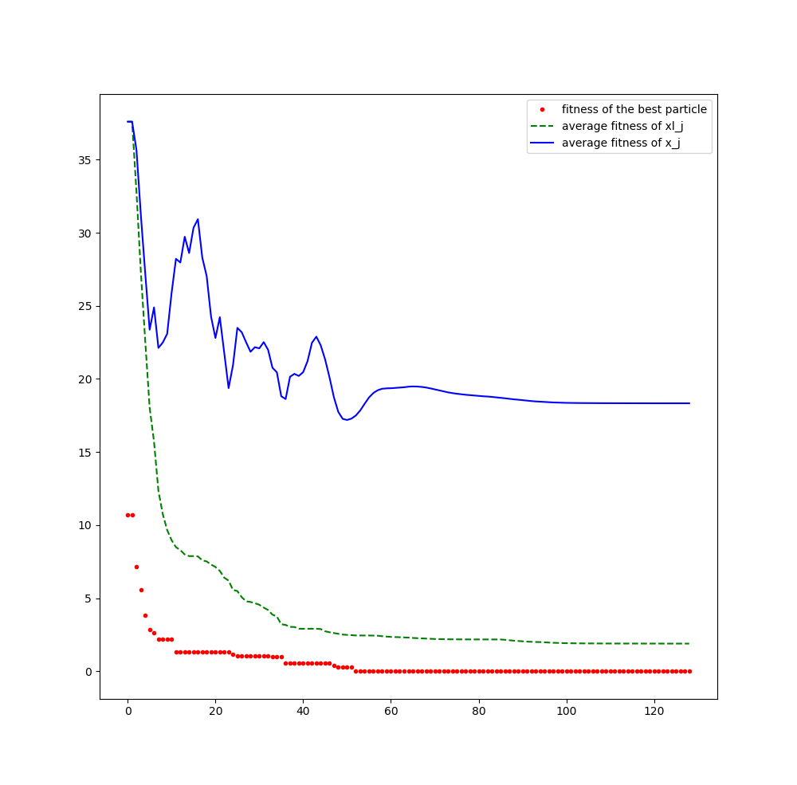



## Ройовий інтелект, або бджоли які не кусаються

Уявіть собі рій бджіл який хоче розв'язати задачу оптимізації. Припустимо, що він летить в <nobr>3-D</nobr> просторі і фітнес-функція є щільністю бузку в повітрі. Будь-хто хто знайомий з біологією скаже, що кожна бджола літає по полю, пам'ятаючи про своє найкраще становище і спілкуючись зі своїми сестрами інформацією про це становище через танці. З часом, (глобальне) оптимальне місце розташування визначається цим колективним інтелектом, і всі літають туди. 

Більш-менш така ж методика застосовується в методі рою частинок. Основний алгоритм працює за допомогою популяції (рою) кандидатних рішень або частинок. Кожен з них рухається навколо простору пошуку, керуючись двома факторами. Перший &mdash; це його особиста найкраща позиція під час усього попереднього пошуку. Другий є найкращим положенням по всьому рою. Тим самим у якийсь момент виникає загальна тенденція до оптимуму і рій сходиться на оптимальному розв'язку.

### Класичний опис

Метод рою частинок (_eng. particle swarm optimization_) належить до класу еволюційних алгоритмів агентного типу та призначений для пошуку глобального екстремуму широкого класу функцій без накладання на них обмежень неперервності та диференційованості. 

Взагалі кажучи, метод можна використовувати для пошуку екстремуму будь-якої функції, яка може бути обчислена на заданій множині вхідних даних і не обов'язково задана в аналітичному вигляді.

Метод виник в середині 90-х років ХХ сторіччя, авторами вважають психолога Джеймса Кеннеді (_eng. Kennedy_) та інженера Рассела Еберхарта (_eng. Eberhart_). В подальшому численні дослідники запропонували різні модифікації цього методу.

Алгоритм шукає екстремальне значення деякої функції $$F(x_1, x_2, \ldots, x_n)$$ на множині $$D = b_{i,\text{low}} \le x_i \le b_{i,\text{up}}$$ (взагалі кажучи на довільній множині, але приналежність такій множині найпростіше перевіряти, тому надалі розглядатимемо саме її).

Рій частинок представляє собою множину $$\left\{P_j, j = \overline{1,L}\right\}$$. Кожна частинка і весь рій в цілому характеризується набором параметрів, що визначає їх стан в конкретний момент часу $$k$$:
		
- $$X_j^{(k)} = \left( x_{j,1}^{(k)}, x_{j, 2}^{(k)}, \ldots, x_{j, n}^{(k)} \right)$$, $$j = \overline{1,L}$$ &mdash; положення частинки $$P_j$$ в $$n$$-вимірному просторі.

- Для кожної частинки $$P_j$$ в кожний момент часу $$k$$ може бути обчислене значення цільової функції, часто її називають фітнес-функцією (або функцією пристосваності): 

	$$
	F_j^{(k)} = F \left( X_j^{(k)} \right) = F \left( x_{j,1}^{(k)}, x_{j, 2}^{(k)}, \ldots, x_{j, n}^{(k)} \right).
	$$

- $$V_j^{(k)} = \left( v_{j,1}^{(k)}, v_{j,2}^{(k)}, \ldots, v_{j,n}^{(k)} \right)$$, $$j = \overline{1,L}$$ &mdash; швидкості частинки $$P_j$$ в кожному напрямку.

- $$XL_j = \left( xl_{j,1}, xl_{j, 2}, \ldots, xl_{j, n} \right)$$, $$j = \overline{1,L}$$ &mdash; найкраще положення частинки $$P_j$$ за весь час.
			
- $$XG = \left( xg_1, xg_2, \ldots, xg_n \right)$$ &mdash; найкраще положення всіх частинок за весь час.

Алгоритм представляє собою ітераційний процес з дискретним часом.

На кожній ітерації кожна частинка переміщується з попереднього положення в своє нове положення за певним законом, при цьому закон переміщення кожної частинки рою враховує своє найкраще (екстремальне положення, локальний екстремум) і найкраще положення найкращої частинки рою (глобальний екстремум). 

Для ініціалізації ітераційного процесу початковий стан $$X_j^{(0)}$$ кожної частинки $$P_j$$ рою визначається рівномірно розподіленою випадковою величиною заданою на вхідній множині $$D$$.

Початкові швидкості руху кожної частинки також визначаються як випадкові величини рівномірно розподілені на $$n$$-вимірному паралелепіпеді $$\Pi = [- \varepsilon, \varepsilon]^n$$, де $$\varepsilon$$ &mdash; деяке мале число. Допускається також і нульове значення швидкості.

На кожній ітерації (в кожній момент часу) обчислюється нова швидкість кожної частинки рою за формулою:
		
$$
V_{j,i}^{(k + 1)} = \omega \cdot V_{j,i}^{(k)} + a_1 \cdot \text{rand} \cdot \left( xl_{j,i} - x_{j,i}^{(k)} \right) + a_2 \cdot \text{rand} \cdot \left( xg_{i} - x_{j,i}^{(k)} \right),
$$
		
де $$\omega = 1 - \varepsilon$$ &mdash; коефіцієнт інерції ($$\varepsilon\approx 10^{-2}$$ тут вже інше), $$a_1, a_2$$ &mdash; постійні значення прискорень, $$\text{rand}$$ &mdash; випадкова величина рівномірно розподілена на відрізку $$[0,1]$$.

Після обчислення значення швидкості обчислюється нове положення кожної частинки 

$$
X_j^{(k + 1)} = X_j^{(k)} + V_j^{(k)}.
$$

Критерієм зупинки може бути досягнення заданого числа ітерацій або будь-який інший критерій. 

Окремо зауважимо, що якщо якась частинка $$P_j$$ рою виходить за межі допустимої області $$D$$ то її можна і варто повернути, наприклад у положення $$XL_j$$.

### Спостереження

Перш за все хочу сказати що мої чисельні експерименти показали, що на практиці алгоритм краще працює якщо не фіксувати $$a_1,a_2$$ а визначати їх наступним чином:

- Нехай $$ b_1^{(k)} = F \left( XL_j \right) - F \left( X_j^{(k)} \right) $$.
			
- Аналогічно визначаємо $$ b_2^{(k)} = F \left( XG \right) - F \left( X_j^{(k)} \right) $$.

- Покладаємо 

	$$
	a_1^{(k)} = \text{sgn} \left( b_1^{(k)} \right) \cdot \frac{\left(b_1^{(k)}\right)^2}{\left(b_1^{(k)}\right)^2 + \left(b_2^{(k)}\right)^2},
	$$ 

	а також 

	$$
	a_2^{(k)} = \text{sgn}\left(b_2^{(k)}\right) \cdot \frac{\left(b_2^{(k)}\right)^2}{\left(b_1^{(k)}\right)^2 + \left(b_2^{(k)}\right)^2}.
	$$
	
- Це відповідає тій еврестиці, що якщо глобальний оптимум значно кращий ніж локальний оптимум певної частинки то вона починає швидше рухатися саме до глоабльного оптимуму а не до свого.

Зауважимо що такий підхід також позбавляє дослідника необхідності підбирати відношення $$a_1/a_2$$.

Чому цей алгоритм називають _ройовим інтелектом_? Тут все доволі просто, кожна частинка моделює маленьку живу істоту яка пам'ятає своє найкраще положення і якось дізнається найкраще положення всього рою, а далі просто рухається у напрямку цих двох найкращих положень, якось при цьому балансуючи швидкість наближення до обох цих положень.
	
Навіщо нам _інреція_? Також просто, без неї довільна точка потрапивши б у нове оптимальне для рою положення миттєво б зупинилася, що нелогічно адже вона йшла у напрямку попереднього мінімуму і цілком можливо що між старим і новим мінімумами є ще кращий (тобто менший) мінімум.

Можна використовувати випадковий крок $$\text{rand}$$ свій по кожній змінній, тобто 

$$
\text{RAND} = \left( \text{rand}_1, \text{rand}_2, \ldots, \text{rand}_n \right).
$$

Можна змінювати (зменшувати) $$\omega$$ від ітерації до ітерації, на практиці це покращує збіжність. Еврестичною інтерпретацією може слугувати _температура навколишнього середовища_: чим вона більше тим більше руху, і навпаки.

### Реалізація

Наведемо тут мій код на python:

- Імпорти:
	
```python
#!/usr/bin/env python
import matplotlib.pyplot as plt
from matplotlib.ticker import MaxNLocator
from random import uniform, seed
from math import cos, pi, exp, sqrt
from typing import List
```

- Параметри задачі:

```python
n, l = 2, 50


def f(Xj: List[float]) -> float:
	""" Rastrigin function """
	return 10 * n + sum(Xj[i]**2 - 10 * cos(2 * pi * Xj[i]) for i in range(n))


b_lo, b_up = -5.12, 5.12
```

- Параметри алгоритму:

```python
seed(65537)

_omega, step, max_iter, grid_sz = .99, .1, 1 << 7, 100 + 1


def sign(x: float) -> float:
	return (x > 0) - (x < 0)


def a(Xj: List[float], XLj: List[float], XG: List[float]) -> float:
	b1, b2 = f(Xj) - f(XLj), f(Xj) - f(XG)

	return sign(b1) * (.5 + b1**2) / (1 + b1**2 + b2**2), \
		sign(b2) * (.5 + b2**2) / (1 + b1**2 + b2**2)


def omega(k):
	return _omega * (1 - k / (2 * max_iter))
```

- Початковий стан рою:

```python
X = [[uniform(b_lo, b_up) for i in range(n)] for j in range(l)]
V = [[uniform(-step, step) for i in range(n)] for j in range(l)]
F = [f(X[j]) for j in range(l)]
XL, XG = X[:], X[F.index(min(F))]
```

- Графіки:

```python
def plot():
	fig = plt.figure(figsize=(10, 10))
	plt.axis([b_lo, b_up, b_lo, b_up])
	xs = [b_lo + (b_up - b_lo) * i / (grid_sz - 1) for i in range(grid_sz)]
	x1s, x2s = [[xs[i] for i in range(grid_sz)] for j in range(grid_sz)], \
		[[xs[j] for i in range(grid_sz)] for j in range(grid_sz)]
	fs = [[f([x1s[i][j], x2s[i][j]]) for j in range(grid_sz)] for i in range(grid_sz)]
	fs_raw = [fs[i][j] for i in range(grid_sz) for j in range(grid_sz)]
	levels = MaxNLocator(nbins=10).tick_values(min(fs_raw), max(fs_raw))
	plt.contourf(x1s, x2s, fs, levels=levels, cmap="RdBu_r")
	plt.colorbar()
	plt.contour(x1s, x2s, fs, levels=levels, colors='k')
	px1s, px2s = [X[j][0] for j in range(l)], [X[j][1] for j in range(l)]
	plt.scatter(px1s, px2s, c='k')
	plt.quiver(px1s, px2s, [V[j][0] for j in range(l)], [V[j][1] for j in range(l)], 
		scale=10)
	plt.draw()
	plt.pause(.1)
	plt.savefig(f'img/{k}.png')
	plt.close()


def plot_err():
	ks = list(range(max_iter + 1))
	fig = plt.figure(figsize=(10, 10))
	plt.plot(ks, err_best, 'r.', label='fitness of the best particle')
	plt.plot(ks, err_local, 'g--', label='average fitness of xl_j')
	plt.plot(ks, err_mean, 'b-', label='average fitness of x_j')
	plt.legend(loc='upper right')
	plt.draw()
	plt.pause(5)
	plt.savefig(f'img/err_plot.png')
	plt.close()
```

- Логування значень цільової функції:

```python
err_best = [f(XG)]
xy_best = [XG]
err_local = [sum(f(XL[j]) for j in range(l)) / l]
err_mean = [sum(f(X[j]) for j in range(l)) / l]


def err():
	global err_mean, err_local, err_best
	xy_best.append(XG)
	err_best.append(f(XG))
	err_local.append(sum(f(XL[j]) for j in range(l)) / l)
	err_mean.append(sum(f(X[j]) for j in range(l)) / l)


def log_err():
	with open(f'err.log', 'w') as out:
		for k in range(max_iter):
			out.write(f'iteration number {k}:\n'
				f'\txy_best   = {xy_best[k]},\n'
				f'\terr_best  = {err_best[k]},\n'
				f'\terr_local = {err_local[k]},\n'
				f'\terr_mean  = {err_mean[k]}.\n\n')
```

- Власне алгоритм:

```python
for k in range(max_iter):
	rand = [uniform(0, step) for j in range(l)]

	for j in range(l):
		a1, a2 = a(X[j], XL[j], XG)
		V[j] = [omega(k) * V[j][i] + rand[j] * (a1 * (XL[j][i] - X[j][i]) + \
			a2 * (XG[i] - X[j][i])) for i in range(n)]

	if n == 2:
		plot()
	
	err()

	for j in range(l):
		X[j] = [X[j][i] + V[j][i] for i in range(n)]

	X = [X[j] if all(b_lo < X[j][i] < b_up for i in range(n)) else XL[j] for j in range(l)]
	XL = [XL[j] if f(XL[j]) < f(X[j]) else X[j] for j in range(l)]
	F = [f(X[j]) for j in range(l)]
	XG = XG if f(XG) < min(F) else X[F.index(min(F))]

plot_err()
log_err()
```

### Графіки різних похибок від ітерації до ітерації:
	


Зауважимо, щоправда, що похибка оптимальної частинки доволі швидко спадає, маємо:
	
```
iteration number 0:
	err_best  = 10.72367840750811,
	err_local = 37.606203413996475,
	err_mean  = 37.606203413996475.

...

iteration number 35:
	err_best  = 1.004272168809841,
	err_local = 3.2115421190175333,
	err_mean  = 18.815225728472793.

...

iteration number 78:
	err_best  = 0.0001300511232003032,
	err_local = 2.173145122446927,
	err_mean  = 18.893561444490327.

...

iteration number 100:
	err_best  = 9.894172315227934e-06,
	err_local = 1.9148161795971204,
	err_mean  = 18.36312530929001.
```

І це всього лише 50 частинок у рої.

### Анімація


[Назад на головну](../README.md)